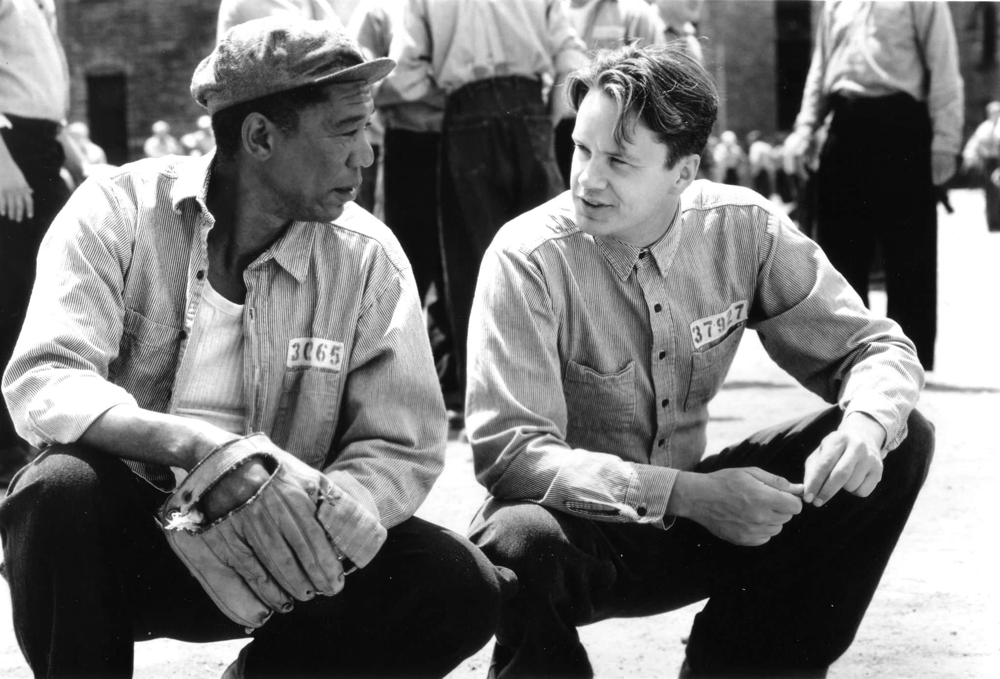
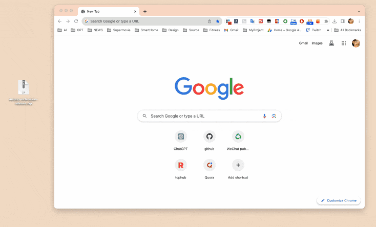
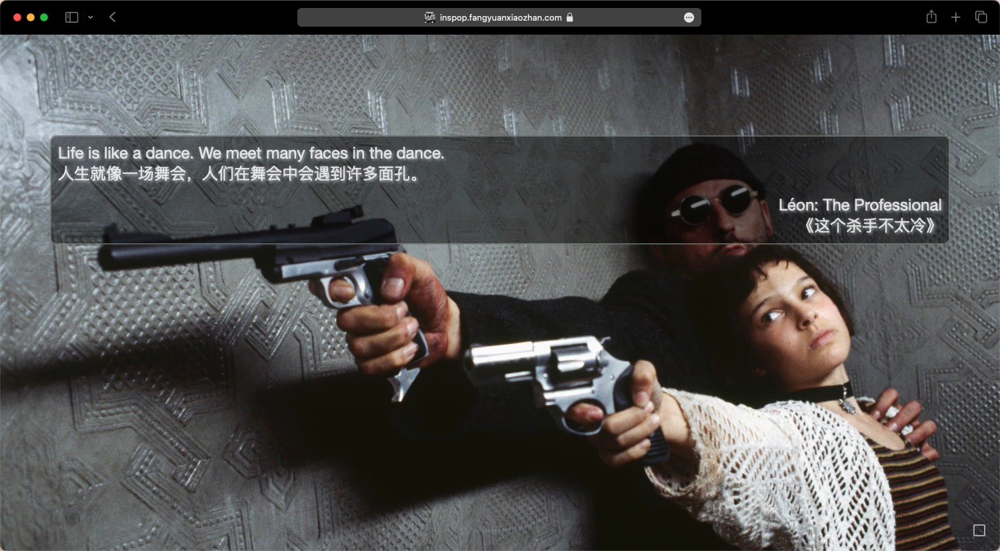
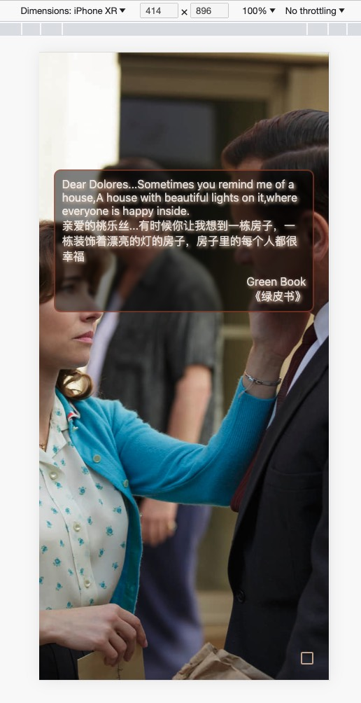
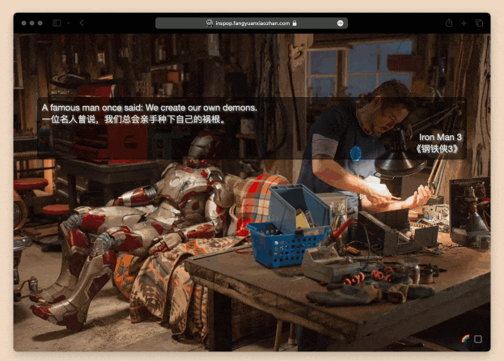
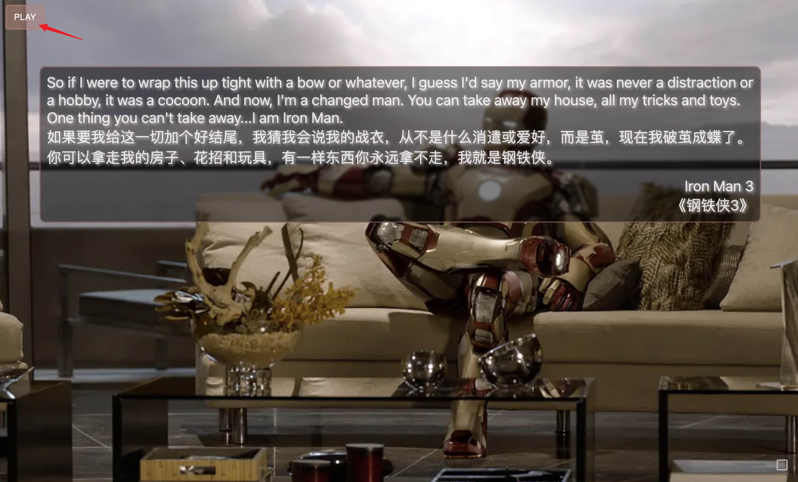

# InsPop  用英语经典语录原音学英语

用英语经典语录原音学英语 (支持浏览器扩展程序，新Tab碎片化时间学习; 支持Web)

一个优雅的英语学习工具，英语教材很多长难句都毫无美感，这个InsPop项目，收录各种经典电影，电视剧，纪录片的经典语录，以及中英文释义，原版音频，精美海报，每次打开浏览器新Tab，能看到经典句子以及海报，利用碎片化时间无痛学英语。

[Web版: https://inspop.fangyuanxiaozhan.com/](https://inspop.fangyuanxiaozhan.com/)

[Chrome扩展程序版下载: inspop-extension-release.zip](https://github.com/zhaoolee/inspop/raw/main/inspop-extension-release.zip)

iOS App开发中 🚧 ...

---start---
## 目录(目前收录71条，2023年10月10日更新，点击🔊收听原音) 

| English | 中文 | 发音 | 
 | --- | --- | --- |
| What would you regard as the defining moment of your life? I think that'd be the day I decided not to let my injury beat me. | 你觉得你这辈子的决定性时刻是什么时候？是我下定决心要战胜伤痛的那天 | 建造中... | 
| True story about fortune cookies. They look Chinese, they sound Chinese, but they're actually an American invention. Which is why they're hollow, full of lies, and leave a bad taste in the mouth. | 福饼的真相是它们看上去像来自中国，听上去也像，但其实它们是美国制造，所以它们是空心的，充满了谎言，还会在嘴里留下恶心的味道。 | 建造中... | 
| Before he built rockets for the Nazis, the idealistic Werner von Braun dreamed of space travel, he stargazed. Do you know what he said when the first V2 hit London? The rocket performed perfectly, it just landed on the wrong planet. See we all begin wide-eyed, pure science. And then the ego steps in, the obsession. And...you look up, you're a long way from shore. | 在为纳粹制造火箭以前，理想主义的维尔纳·冯·布劳恩，德国核物理学家和火箭专家，纳粹乙级战犯，幻想着航天旅行，他喜欢仰望星空，第一枚V2火箭击中伦敦后，你知道他说了什么吗？火箭运行得很完美，它只是落在了错误的星球上，我们开始时都很天真，纯粹的科学，然后自大心开始作祟  变得痴迷，抬头看时，已经偏离了很远。 | 建造中... | 
| You know what my old man used to say to me? One of his favorite of many sayings, The early bird gets the worm, but the second mouse gets the cheese. | 你知道我老爸以前是怎么跟我说的吗？他最喜欢说的一句话是，早起的鸟儿有虫吃，但是第二只老鼠有奶酪吃。 | 建造中... | 
| Einstein slept three hours a year. Look what he did | 爱因斯坦一年才睡三小时，看看他干了什么 | 建造中... | 
| A famous man one said: We create our own demons. | 一位名人曾说，我们总会亲手种下自己的祸根。 | 建造中... | 
| Gods, aliens, other dimensions. I'm just a man in a can. The only reason I haven't cracked up is probably because you moved in. | 神祇，外星人，其他维度。我只是个身处铁甲的凡人。我还没有崩溃，可能的唯一原因就是你的出现。 | [🔊](https://inspop.fangyuanxiaozhan.com/av/IronMan3GodsAliensOtherDimensions/Iron%20Man%203%20%282013%29%20%5Bimdbid-tt1300854%5D%20-%201080p_00_21_40_64-00_21_48_164.mp3) | 
| So if I were to wrap this up tight with a bow or whatever, I guess I'd say my armor, it was never a distraction or a hobby, it was a cocoon. And now, I'm a changed man. You can take away my house, all my tricks and toys. One thing you can't take away...I am Iron Man. | 如果要我给这一切加个好结尾，我猜我会说我的战衣，从不是什么消遣或爱好，而是茧，现在我破茧成蝶了。你可以拿走我的房子、花招和玩具，有一样东西你永远拿不走，我就是钢铁侠。 | [🔊](https://inspop.fangyuanxiaozhan.com/av/IronMan3SoIfIWereTo/Iron%20Man%203%20%282013%29%20%5Bimdbid-tt1300854%5D%20-%201080p_01_58_59_438-01_59_39_121.mp3) | 
| If it were any smarter, it would write a book. A book that would make Ulysses look like it was written in crayon. It would read it to you. | 它再聪明一点就会自己写书，绝对比小说《尤利西斯》更艰涩，而且还会自己读给你听。 | [🔊](https://inspop.fangyuanxiaozhan.com/av/IronMan2IfITWereAnySmarter/Iron%20Man%202%20%282010%29%20%5Bimdbid-tt1228705%5D%20-%201080p_01_12_05_500-01_12_13_549.mp3) | 
| It's completely elegant. It's bafflingly beautiful. It's capable of reducing the population of any standing structure to zero. I call it the Ex-Wife. | 我的经典之作，造型优雅，美到不行，可以把任何建筑物夷为平地，我把它命名为〝前妻〞。 | [🔊](https://inspop.fangyuanxiaozhan.com/av/IronMan2ItISCompletelyElegant/Iron%20Man%202%20%282010%29%20%5Bimdbid-tt1228705%5D%20-%201080p_01_12_18_429-01_12_29_27.mp3) | 
| And there will be blood in the water. And the sharks will come. The truth, all I have to do is sit here and watch as the world will consume you. | 当水中有血迹，就会引来鲨鱼，我只要坐在这里看，世人就会把你吞噬。 | [🔊](https://inspop.fangyuanxiaozhan.com/av/IronMan2AndThereWillBe/Iron%20Man%202%20%282010%29%20%5Bimdbid-tt1228705%5D%20-%201080p_00_39_35_216-00_39_48_521.mp3) | 
| Did you bring me strawberries? Did you know that there's only one thing on Earth that I'm allergic to? Allergic to strawberries. | 你带了草莓给我？你知道全世界我只对一样东西过敏吗？对草莓过敏。 | [🔊](https://inspop.fangyuanxiaozhan.com/av/IronMan2DidYouBringMeStrawberries/Iron%20Man%202%20%282010%29%20%5Bimdbid-tt1228705%5D%20-%201080p_01_18_44_274-01_18_53_449.mp3) | 
| Please, it's not about me. It's not about you. It's not even about us. It's about legacy. It's about what we choose to leave behind for future generations. | 我并不重要，你们也不重要，我们都不重要，重要的是传承，我们该替未来世代留下什么。 | [🔊](https://inspop.fangyuanxiaozhan.com/av/IronMan2PleaseItIsNotAboutMe/Iron%20Man%202%20%282010%29%20%5Bimdbid-tt1228705%5D%20-%201080p_00_08_04_409-00_08_19.mp3) | 
| Oh, it's beautiful. Tony, this is your Ninth Symphony. What a masterpiece. Look at that. This is your legacy. | 真是美丽，托尼，这是你的第九交响乐，真是杰作，看啊，这是你的遗产。 | 建造中... | 
| It's an imperfect world, but it's the only one we've got. I guarantee you, the day weapons are no longer needed to keep the peace, I'll start making bricks and beams for baby hospitals. | 这是个不完美的世界，但我们只有这个世界，我向你保证，如果哪天再不需要武器来维护和平了，我会开始为婴儿医院制造建材的 | 建造中... | 
| If my math is right, and it always is, three gigajoules per second. That could run your heart for 50 lifetimes. Or something big for 15 minutes. | 如果我没算错，我通常不会算错，每秒能产生3千兆焦耳，那足以让你的心跳50辈子，或者让什么大玩意跑15分钟。 | 建造中... | 
| The bow and arrow once was the pinnacle of weapons technology. It allowed the great Genghis Khan to rule from the Pacific to the Ukraine. An empire twice the size of Alexander the Great and four times the size of the Roman Empire. But today, whoever holds the latest Stark weapons rules these lands. | 弓和箭，曾是武器科技的巅峰，让伟大的成吉思汗，一统从太平洋到乌克兰之间的土地，他的帝国是亚历山大大帝的两倍，是罗马帝国的四倍，但今天有最新的斯塔克工业武器的人，就能统治这些土地。 | 建造中... | 
| My old man had a philosophy, Peace means having a bigger stick than the other guy. | 我老爸有个理论，和平就是比对方的棍子大 | 建造中... | 
| So stooping down in the gravel, pitching dice for pocket change makes you a winner? They did not have a choice wheather to be inside or out,You did.Now wipe off your kness.You have dirt on them. | 那你弯腰屈膝在碎石地上，掷骰子赢几个零钱，就是赢家了，他们没有选择是否进场的权利，但是你有，拍拍膝盖吧，沾了土 | 建造中... | 
| Dear Dolores...Sometimes you remind me of a house,A house with beautiful lights on it,where everyone is happy inside. | 亲爱的桃乐丝...有时候你让我想到一栋房子，一栋装饰着漂亮的灯的房子，房子里的每个人都很幸福 | 建造中... | 
| So, if I am not black enough and if I am not white enough and if I am not man enough, then tell me, Tony, what am I? | 所以如果我既不够黑，也不够白，甚至不够男人，那你告诉我，托尼，我是谁？ | 建造中... | 
| I'm not crazy, I'm a writer. | 我不是疯子，我是个作家。 | 建造中... | 
| I'm not crazy, I'm your friend. | 我不是疯子，我是你的朋友。 | 建造中... | 
| I'm the Dark Knight. | 我是黑暗的骑士。 | 建造中... | 
| I'm just an ordinary person, trying to live an ordinary life. | 我只是个普通人，试图过普通的生活。 | 建造中... | 
| I'm not a genius, I'm just curious. | 我不是天才，我只是好奇。 | 建造中... | 
| I'm a simple person, I like simple things. | 我是个简单的人，我喜欢简单的事。 | 建造中... | 
| I don't care what they think of me. | 我不在乎他们怎么看我。 | 建造中... | 
| We are all stardust. | 我们都是星尘。 | 建造中... | 
| You have to believe in yourself. | 你要相信你自己。 | 建造中... | 
| Fear can hold you prisoner, hope can set you free. | 恐惧可以让你成为囚犯，希望可以让你自由。 | 建造中... | 
| I have a bad feeling about this. | 我有一个不详的预感。 | 建造中... | 
| I'm not a bad guy, I'm just a businessman. | 我不是恶人，我只是个商人。 | 建造中... | 
| Life is like a game, we are all players. | 生活就像一场游戏，我们都是玩家。 | 建造中... | 
| I'm not a god, I'm just a man. | 我不是神，我只是个人。 | 建造中... | 
| Never say goodbye, because goodbye means going away, and going away means forgetting. | 永远不要说再见，因为再见意味着走远，走远意味着分离。 | 建造中... | 
| I'm just a feather, floating in the wind. | 我只是一只羽毛，飘在风中。 | 建造中... | 
| Run, Forrest, run! | 跑，阿甘，跑！ | 建造中... | 
| I'm a fair person as long as you are fair to me. | 我是一个公平的人，只要你也公平对我。 | 建造中... | 
| I've always been here. | 我一直在这里。 | 建造中... | 
| I'm not crazy, I'm normal. | 我不是疯子，我是正常人。 | 建造中... | 
| What we need is not a hero, but to restore the world to normal. | 我们需要的不是英雄，而是让世界恢复正常。 | 建造中... | 
| I don't have time to worry about people who won't worry about themselves. | 我没有时间为那些不愿意为自己生活的人操心。 | 建造中... | 
| My thoughts are free. | 我的思想是自由的。 | 建造中... | 
| Life is like a dance. We meet many faces in the dance. | 人生就像一场舞会，人们在舞会中会遇到许多面孔。 | 建造中... | 
| I'll never love anyone else. | 我不会再爱别人了。 | 建造中... | 
| We are all children of the same mother. | 我们都是同一个母亲的孩子。 | 建造中... | 
| You got a dream, you gotta protect it. | 你有梦想就要去捍卫它。 | 建造中... | 
| Some birds aren't meant to be caged. Their feathers are just too bright. | 有些鸟儿是关不住的，因为他们的羽毛太亮了。 | 建造中... | 
| I am your father. | 我是你的父亲。 | 建造中... | 
| I'm not a godfather. | 我不是教父。 | 建造中... | 
| No one can give you power. You have to take it. | 没有人可以给你权力，你必须争取。 | 建造中... | 
| You can't take away my freedom. | 你不能夺走我的自由。 | 建造中... | 
| I'm the king of the world! | 我是世界之王！ | 建造中... | 
| I may not be a smart man, but I know what love is. | 我不是个聪明人，但我知道什么是爱。 | 建造中... | 
| Mama always said, stupid is as stupid does. | 妈妈总是说，傻人有傻福。 | 建造中... | 
| Keep your friends close, but your enemies closer. | 保持你的朋友接近，但是保持你的敌人更接近。 | 建造中... | 
| Here's Johnny! | 这里是约翰尼！ | 建造中... | 
| I must be crazy to be in a loony bin like this. | 我必须疯了，否则我不会在这儿。 | 建造中... | 
| You either die a hero, or you live long enough to see yourself become the villain. | 你要么死成英雄，要么活得足够长的时间，看到自己成为恶人。 | 建造中... | 
| It's not personal, it's business. | 这不是个人的，这是生意。 | 建造中... | 
| I have to believe that something extraordinary is possible. | 我必须相信，对于我自己，我的工作，我的家庭，我的朋友，我的生活，一切都有可能。 | 建造中... | 
| I like these calm little moments before the storm. Do you? | 我喜欢这种感觉，你呢？ | 建造中... | 
| After all, tomorrow is another day! | 明天又是新的一天。 | 建造中... | 
| I see you. | 我看到你。 | 建造中... | 
| Don't ever let somebody tell you you can't do something. | 不要让人告诉你你不能做什么。 | 建造中... | 
| Hope is a good thing, maybe the best of things, and no good thing ever dies. | 希望是件好事，也许是人间至善，而美好的事永不消逝。 | 建造中... | 
| May the Force be with you. | 愿原力与你同在。 | 建造中... | 
| I'm gonna make him an offer he can't refuse. | 我会给他一个他无法拒绝的提议。 | 建造中... | 
| Life is like a box of chocolates, you never know what you're gonna get. | 生活就像一盒巧克力，你永远不知道下一块是什么。 | 建造中... | 
| I jump, you jump. | 你跳，我也跳。 | 建造中... | 

---end---

## 如何安装扩展程序

## Web版效果

如果不使用扩展程序，也可以使用Web版体验

勾选右下角的选择框，可以使用更多功能，取消勾选，则自动隐藏，如果在菜单中了定时切换，则可以在菜单中看到定时切换的倒计时，刷新页面依然可以保持定时切换

## 支持手动切换语录配图(语录配图与语录出自同一作品)

## 支持手动切换上一句，下一句

## 支持自动播放，支持选择自动播放的间隔时间(gif图三倍速)

## 支持播放原音(资源补充中)

zhaoolee自用快剪脚本 [get_voice_video.sh](https://github.com/zhaoolee/inspop/blob/main/get_voice_video.sh)

## 本项目开放数据源

相关数据源位置

https://github.com/zhaoolee/inspop/tree/main/next-inspop/public

## 参考资料

https://github.com/shimohq/chinese-programmer-wrong-pronunciation

## 开源地址

https://github.com/zhaoolee/inspop