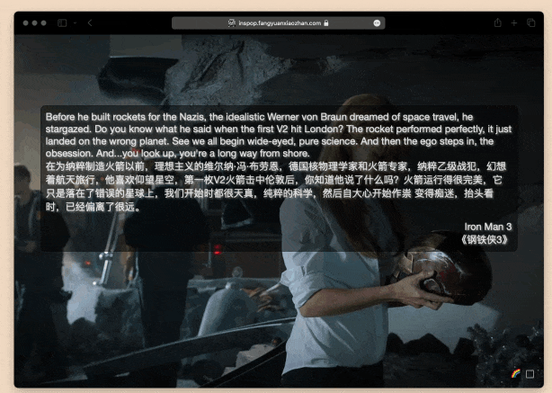

# InsPop

新Tab随机展示中英对照的经典作品语录, 支持自动切换

## 开源地址

https://github.com/zhaoolee/inspop

## 更优雅的英语学习工具

对于各行各业的上班族而言，提升英语水平总有益无害的。

培训机构给出的英语教材包含了大量的长难句，用句子学英语确实比纯备单词效率高很多，但很多长难句都是为了复杂而复杂，句式毫无美感，于是我做了这个InsPop项目，收录各种经典电影，电视剧，纪录片的经典语录，以及中英文释义，并配上语录来源作品的精美海报，每次打开浏览器新页面，都能看到一句经典句子以及对应海报，且支持定时轮播，手动切换语录或海报。 

在线Web体验版: https://inspop.fangyuanxiaozhan.com/

Chrome扩展程序版: [inspop-extension-release.zip](https://github.com/zhaoolee/inspop/raw/main/inspop-extension-release.zip)

---start---
## 目录(目前收录71条，2023年10月08日更新)

What would you regard as the defining moment of your life? I think that'd be the day I decided not to let my injury beat me./你觉得你这辈子的决定性时刻是什么时候？是我下定决心要战胜伤痛的那天 | Iron Man 3《钢铁侠3》

True story about fortune cookies. They look Chinese, they sound Chinese, but they're actually an American invention. Which is why they're hollow, full of lies, and leave a bad taste in the mouth./福饼的真相是它们看上去像来自中国，听上去也像，但其实它们是美国制造，所以它们是空心的，充满了谎言，还会在嘴里留下恶心的味道。 | Iron Man 3《钢铁侠3》

Before he built rockets for the Nazis, the idealistic Werner von Braun dreamed of space travel, he stargazed. Do you know what he said when the first V2 hit London? The rocket performed perfectly, it just landed on the wrong planet. See we all begin wide-eyed, pure science. And then the ego steps in, the obsession. And...you look up, you're a long way from shore./在为纳粹制造火箭以前，理想主义的维尔纳·冯·布劳恩，德国核物理学家和火箭专家  纳粹乙级战犯，幻想着航天旅行，他喜欢仰望星空，第一枚V2火箭击中伦敦后，你知道他说了什么吗？火箭运行得很完美，它只是落在了错误的星球上，我们开始时都很天真，纯粹的科学，然后自大心开始作祟  变得痴迷，抬头看时，已经偏离了很远。 | Iron Man 3《钢铁侠3》

You know what my old man used to say to me? One of his favorite of many sayings, The early bird gets the worm, but the second mouse gets the cheese./你知道我老爸以前是怎么跟我说的吗？他最喜欢说的一句话是，早起的鸟儿有虫吃，但是第二只老鼠有奶酪吃。 | Iron Man 3《钢铁侠3》

Einstein slept three hours a year. Look what he did/爱因斯坦一年才睡三小时，看看他干了什么 | Iron Man 3《钢铁侠3》

A famous man one said: We create our own demons./一位名人曾说，我们总会亲手种下自己的祸根。 | Iron Man 3《钢铁侠3》

I'm just a man in a can. The only reason I haven't cracked up is probably because you moved in./我只是一个躲在铁壳里的人，我至今还没有崩溃的原因，大概就是因为你搬来和我一起住。 | Iron Man 3《钢铁侠3》

So if I were to wrap this up tight with a bow or whatever, I guess I'd say my armor, it was never a distraction or a hobby, it was a cocoon. And now, I'm a changed man. You can take away my house, all my tricks and toys. One thing you can't take away...I am Iron Man./如果要我给这一切加个好结尾，我猜我会说我的战衣，从不是什么消遣或爱好，而是茧，现在我破茧成蝶了。你可以拿走我的房子、花招和玩具，有一样东西你永远拿不走，我就是钢铁侠。 | Iron Man 3《钢铁侠3》

If it were any smarter, it would write a book. A book that would make Ulysses look like it was written in crayon. It would read it to you./它再聪明一点就会自己写书，绝对比小说《尤利西斯》更艰涩，而且还会自己读给你听。 | Iron Man 2《钢铁侠2》

It's completely elegant. It's bafflingly beautiful. It's capable of reducing the population of any standing structure to zero. I call it the Ex-Wife./我的经典之作，造型优雅，美到不行，可以把任何建筑物夷为平地，我把它命名为〝前妻〞。 | Iron Man 2《钢铁侠2》

And there will be blood in the water. And the sharks will come. The truth, all I have to do is sit here and watch as the world will consume you./当水中有血迹，就会引来鲨鱼，我只要坐在这里看，世人就会把你吞噬。 | Iron Man 2《钢铁侠2》

Did you bring me strawberries? Did you know that there's only one thing on Earth that I'm allergic to? Allergic to strawberries./你带了草莓给我？你知道全世界我只对一样东西过敏吗？对草莓过敏。 | Iron Man 2《钢铁侠2》

Please, it's not about me. It's not about you. It's not even about us. It's about legacy. It's about what we choose to leave behind for future generations./我并不重要，你们也不重要，我们都不重要，重要的是传承，我们该替未来世代留下什么。 | Iron Man 2《钢铁侠2》

Oh, it's beautiful. Tony, this is your Ninth Symphony. What a masterpiece. Look at that. This is your legacy./真是美丽，托尼，这是你的第九交响乐，真是杰作，看啊，这是你的遗产。 | Iron Man《钢铁侠》

It's an imperfect world, but it's the only one we've got. I guarantee you, the day weapons are no longer needed to keep the peace, I'll start making bricks and beams for baby hospitals./这是个不完美的世界，但我们只有这个世界，我向你保证，如果哪天再不需要武器来维护和平了，我会开始为婴儿医院制造建材的 | Iron Man《钢铁侠》

If my math is right, and it always is, three gigajoules per second. That could run your heart for 50 lifetimes. Or something big for 15 minutes./如果我没算错，我通常不会算错，每秒能产生3千兆焦耳，那足以让你的心跳50辈子，或者让什么大玩意跑15分钟。 | Iron Man《钢铁侠》

The bow and arrow once was the pinnacle of weapons technology. It allowed the great Genghis Khan to rule from the Pacific to the Ukraine. An empire twice the size of Alexander the Great and four times the size of the Roman Empire. But today, whoever holds the latest Stark weapons rules these lands./弓和箭，曾是武器科技的巅峰，让伟大的成吉思汗，一统从太平洋到乌克兰之间的土地，他的帝国是亚历山大大帝的两倍，是罗马帝国的四倍，但今天有最新的斯塔克工业武器的人，就能统治这些土地。 | Iron Man《钢铁侠》

My old man had a philosophy, Peace means having a bigger stick than the other guy./我老爸有个理论，和平就是比对方的棍子大 | Iron Man《钢铁侠》

So stooping down in the gravel, pitching dice for pocket change makes you a winner? They did not have a choice wheather to be inside or out,You did.Now wipe off your kness.You have dirt on them./那你弯腰屈膝在碎石地上，掷骰子赢几个零钱，就是赢家了，他们没有选择是否进场的权利，但是你有，拍拍膝盖吧，沾了土 | Green Book《绿皮书》

Dear Dolores...Sometimes you remind me of a house,A house with beautiful lights on it,where everyone is happy inside./亲爱的桃乐丝...有时候你让我想到一栋房子，一栋装饰着漂亮的灯的房子，房子里的每个人都很幸福 | Green Book《绿皮书》

So, if I am not black enough and if I am not white enough and if I am not man enough, then tell me, Tony, what am I?/所以如果我既不够黑，也不够白，甚至不够男人，那你告诉我，托尼，我是谁？ | Green Book《绿皮书》

I'm not crazy, I'm a writer./我不是疯子，我是个作家。 | The Shining《闪灵》

I'm not crazy, I'm your friend./我不是疯子，我是你的朋友。 | One Flew Over the Cuckoo's Nest《飞越疯人院》

I'm the Dark Knight./我是黑暗的骑士。 | The Dark Knight《黑暗骑士》

I'm just an ordinary person, trying to live an ordinary life./我只是个普通人，试图过普通的生活。 | The Godfather《教父》

I'm not a genius, I'm just curious./我不是天才，我只是好奇。 | A Beautiful Mind《美丽心灵》

I'm a simple person, I like simple things./我是个简单的人，我喜欢简单的事。 | Léon: The Professional《这个杀手不太冷》

I don't care what they think of me./我不在乎他们怎么看我。 | Gone with the Wind《乱世佳人》

We are all stardust./我们都是星尘。 | Avatar《阿凡达》

You have to believe in yourself./你要相信你自己。 | The Pursuit of Happyness《当幸福来敲门》

Fear can hold you prisoner, hope can set you free./恐惧可以让你成为囚犯，希望可以让你自由。 | The Shawshank Redemption《肖申克的救赎》

I have a bad feeling about this./我有一个不详的预感。 | Star Wars《星球大战》

I'm not a bad guy, I'm just a businessman./我不是恶人，我只是个商人。 | The Godfather《教父》

Life is like a game, we are all players./生活就像一场游戏，我们都是玩家。 | Léon: The Professional《这个杀手不太冷》

I'm not a god, I'm just a man./我不是神，我只是个人。 | One Flew Over the Cuckoo's Nest《飞越疯人院》

Never say goodbye, because goodbye means going away, and going away means forgetting./永远不要说再见，因为再见意味着走远，走远意味着分离。 | Titanic《泰坦尼克号》

I'm just a feather, floating in the wind./我只是一只羽毛，飘在风中。 | Forrest Gump《阿甘正传》

Run, Forrest, run!/跑，阿甘，跑！ | Forrest Gump《阿甘正传》

I'm a fair person as long as you are fair to me./我是一个公平的人，只要你也公平对我。 | The Godfather《教父》

I've always been here./我一直在这里。 | The Shining《闪灵》

I'm not crazy, I'm normal./我不是疯子，我是正常人。 | One Flew Over the Cuckoo's Nest《飞越疯人院》

What we need is not a hero, but to restore the world to normal./我们需要的不是英雄，而是让世界恢复正常。 | The Dark Knight《黑暗骑士》

I don't have time to worry about people who won't worry about themselves./我没有时间为那些不愿意为自己生活的人操心。 | The Godfather《教父》

My thoughts are free./我的思想是自由的。 | A Beautiful Mind《美丽心灵》

Life is like a dance. We meet many faces in the dance./人生就像一场舞会，人们在舞会中会遇到许多面孔。 | Léon: The Professional《这个杀手不太冷》

I'll never love anyone else./我不会再爱别人了。 | Gone with the Wind《乱世佳人》

We are all children of the same mother./我们都是同一个母亲的孩子。 | Avatar《阿凡达》

You got a dream, you gotta protect it./你有梦想就要去捍卫它。 | The Pursuit of Happyness《当幸福来敲门》

Some birds aren't meant to be caged. Their feathers are just too bright./有些鸟儿是关不住的，因为他们的羽毛太亮了。 | The Shawshank Redemption《肖申克的救赎》

I am your father./我是你的父亲。 | Star Wars《星球大战》

I'm not a godfather./我不是教父。 | The Godfather《教父》

No one can give you power. You have to take it./没有人可以给你权力，你必须争取。 | Léon: The Professional《这个杀手不太冷》

You can't take away my freedom./你不能夺走我的自由。 | One Flew Over the Cuckoo's Nest《飞越疯人院》

I'm the king of the world!/我是世界之王！ | Titanic《泰坦尼克号》

I may not be a smart man, but I know what love is./我不是个聪明人，但我知道什么是爱。 | Forrest Gump《阿甘正传》

Mama always said, stupid is as stupid does./妈妈总是说，傻人有傻福。 | Forrest Gump《阿甘正传》

Keep your friends close, but your enemies closer./保持你的朋友接近，但是保持你的敌人更接近。 | The Godfather《教父》

Here's Johnny!/这里是约翰尼！ | The Shining《闪灵》

I must be crazy to be in a loony bin like this./我必须疯了，否则我不会在这儿。 | One Flew Over the Cuckoo's Nest《飞越疯人院》

You either die a hero, or you live long enough to see yourself become the villain./你要么死成英雄，要么活得足够长的时间，看到自己成为恶人。 | The Dark Knight《黑暗骑士》

It's not personal, it's business./这不是个人的，这是生意。 | The Godfather《教父》

I have to believe that something extraordinary is possible./我必须相信，对于我自己，我的工作，我的家庭，我的朋友，我的生活，一切都有可能。 | A Beautiful Mind《美丽心灵》

I like these calm little moments before the storm. Do you?/我喜欢这种感觉，你呢？ | Léon: The Professional《这个杀手不太冷》

After all, tomorrow is another day!/明天又是新的一天。 | Gone with the Wind《乱世佳人》

I see you./我看到你。 | Avatar《阿凡达》

Don't ever let somebody tell you you can't do something./不要让人告诉你你不能做什么。 | The Pursuit of Happyness《当幸福来敲门》

Hope is a good thing, maybe the best of things, and no good thing ever dies./希望是件好事，也许是人间至善，而美好的事永不消逝。 | The Shawshank Redemption《肖申克的救赎》

May the Force be with you./愿原力与你同在。 | Star Wars《星球大战》

I'm gonna make him an offer he can't refuse./我会给他一个他无法拒绝的提议。 | The Godfather《教父》

Life is like a box of chocolates, you never know what you're gonna get./生活就像一盒巧克力，你永远不知道下一块是什么。 | Forrest Gump《阿甘正传》

I jump, you jump./你跳，我也跳。 | Titanic《泰坦尼克号》

---end---

## 如何安装扩展程序

## Web版效果

如果不使用扩展程序，也可以使用Web版体验

勾选右下角的选择框，可以使用更多功能，取消勾选，则自动隐藏，如果在菜单中了定时切换，则可以在菜单中看到定时切换的倒计时，刷新页面依然可以保持定时切换

## 支持手动切换语录配图(语录配图与语录出自同一作品)

## 支持手动切换上一句，下一句

## 支持自动播放，支持选择自动播放的间隔时间(gif图三倍速)

## 本项目开放数据源

相关数据源位置

https://github.com/zhaoolee/inspop/tree/main/next-inspop/public

